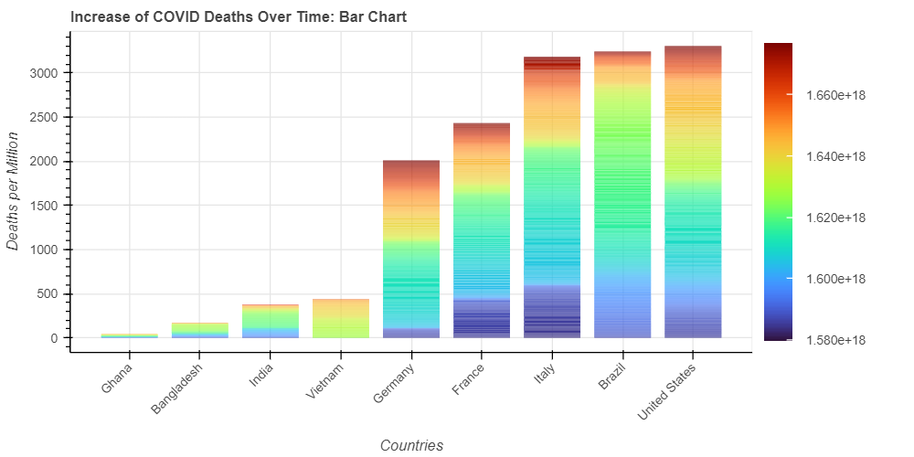
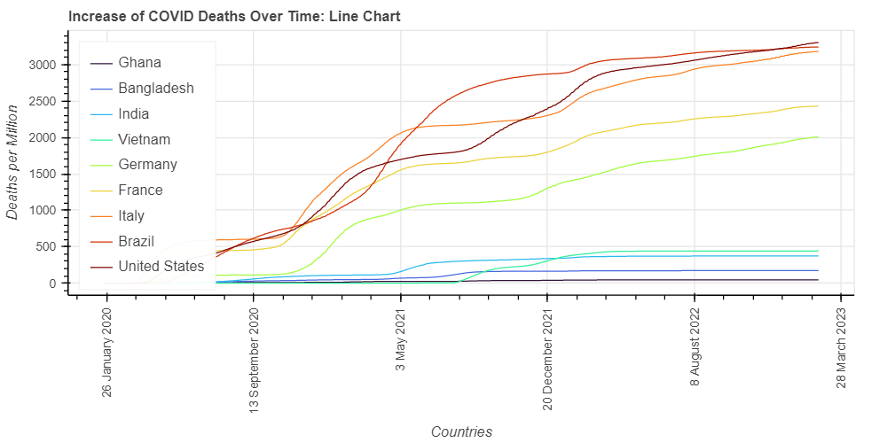

# Stacked Bar Chart for Visualizing Monotonically Varying Data

Line chart is often used for visualizing data. But if the data varies monotonically, it may be replaced by a bar chart.

For the convinience of explanation, let us consider that the data is monotonically varying along time (t).

Design Details:

- The height of this bar chart directly represents the **final** value of the variable (y)
- For each "stack" of bar chart:
  - Start height (bottom) from x-axis denotes the value of variable y at t1
  - End height (top) from x-axis denotes the value of variable y at t2 (t2 > t1)
  - Color encoding represents the average of start and end time (t1+t2)/2

By using this type of encoding:

- **We eliminate the visual clutering of the line chart. This is the main aim of this chart.**
- We can still see the time ranges that caused the growth of variable (y).
- We focus more on the final value of variable (y) and less on the intermediate values. (This may be a good or a bad thing depending on the need of user)

Possible further improvements/changes include:

- Addition of curvy gridlines for constant values of x. This may even eliminate the need of using color encoding for bar chart.
- Extending this idea for monotonically decreasing data.
- Removing the white lines that are created due to stacking too many quads/bar togather in one place.

## Example

In this example, we show how total deaths per million increased (monotonically) over time. The regions of continuous same(similar) color shows that during that color(time range), there was a huge increase in total deaths.

(TODO: Correct the color bar by using datetime formatter)

Compared to this, when we use line chart, we get a cluttered view. To remove this visual clutering, the user needs interaction and/or good color encoding scheme. This becomes particularly challenging as we increase the number of countries.

